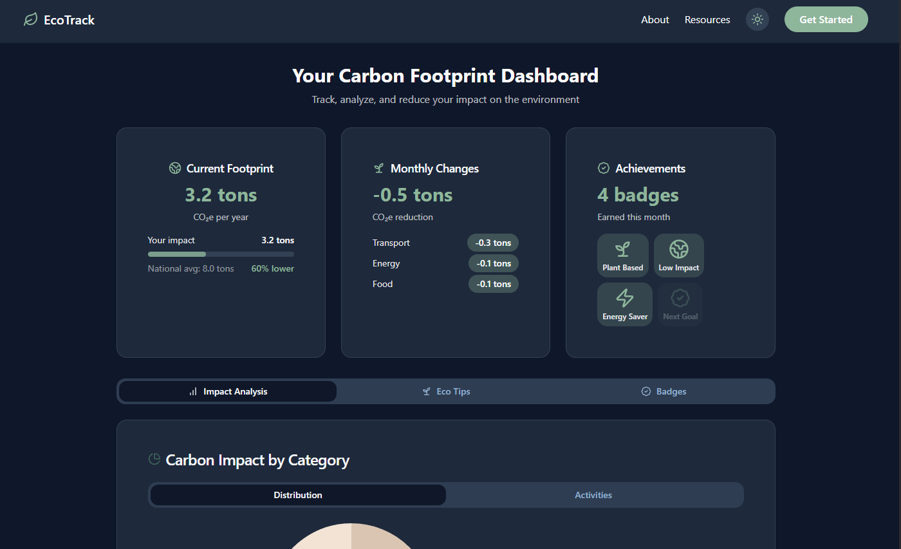
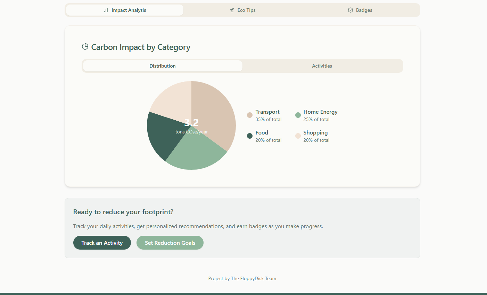
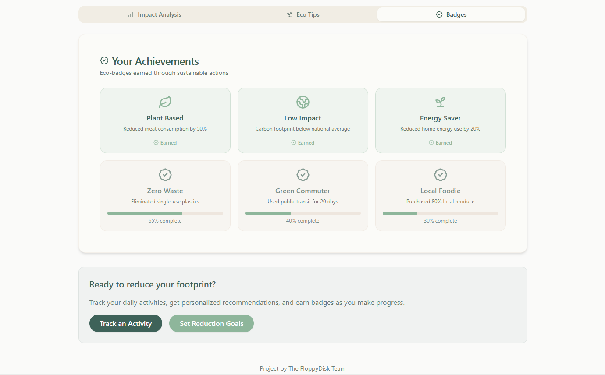

# 🌿 EcoTrack – Carbon Footprint Dashboard

> Built by **Team FloppyDisk** 🖴
Track, analyze & reduce your carbon impact.

## 🔥 What’s This?

**EcoTrack** is a web-based dashboard that visualizes your annual carbon footprint and monthly reductions across key categories like transport, energy, and food. It gamifies sustainability with badges and gives eco-tips to keep you locked in on your green goals.

## 🚀 Features

- 📉 **Real-time Carbon Stats**:  
  View your current CO₂e/year and how you stack up against national averages.
  
- 🔄 **Monthly Reduction Breakdown**:  
  See your carbon cuts – tracked by transport, energy, and food.

- 🏆 **Achievements**:  
  Badges like *Plant Based*, *Energy Saver*, and *Low Impact* keep you motivated.

- 📊 **Carbon Impact by Category**:  
  Visual distribution of which activities hit the environment hardest.

- 🌙 **Dark Mode Support**:  
  Go green, even in the dark.

## 🧠 Tech Stack

- **Frontend**: HTML, CSS, JavaScript, Typescript, Node, React
- **Design**: Figma for wireframes + custom icon set

## 📸 Sneak Peek

## 🧩 Future Upgrades

- 🌍 API integration for real-time environmental data
- 📱 Responsive mobile UI
- 🔔 Notification system for monthly goals
- 💾 User accounts & data sync

## 🧠 Team FloppyDisk

